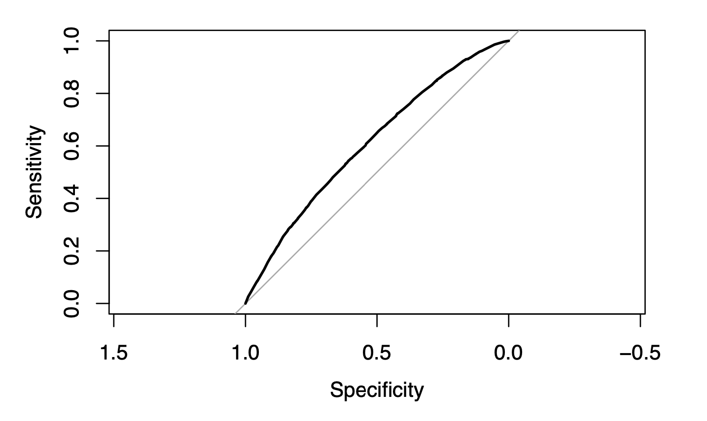

# World Values Survey GLM Analysis
Franchesca Garcia

March 14, 2026

## Data

This analysis is based on data collected from 5,381 adults in 4 different countries as part of the World Values Survey in 1996-1997.

There are 128 rows in the data set — one for each combination of the following 5 categorical predictor variables: 
- **gender** subject’s gender (0 = female, 1 = male)
- **religion** does the subject belong to a religion (0 = no, 1 = yes)
- **degree** does the subject have a university degree (0 = no, 1 = yes)
- **country** subject’s nationality (USA, Australia, Norway, Sweden)
- **age** subject’s age (1 = 30 years or less, 2 = 31-45 years, 3 = 46-60 years, 4 = 61 years or more)

For each predictor combinations, we have three columns representing the count of answers to the response variable: “Do you think the government is doing too little for people in poverty?”
- **yes** the count of subjects answering “yes”
- **no** the count of subjects answering “no”

## Model Selection

Because the World Values Survey response variable is binomial, I began my analysis with a logit model using the main effects of all predictor variables. This model showed lack of fit, so I tried probit, loglog, and cloglog link functions with the same predictors to see if any would better fit the data. These initial models also showed lack of fit, so I then tried stepwise regression on all main effects and 2-way interactions, with each link. The variable selection improved the fit of all four initial models. At this point, there were no issues with any model, and they all performed similarly. I continued with manual variable reduction using a 5% false discovery rate for all four models. The resulting models still performed similarly with equal complexity. The loglog model had a slightly better AIC value, but I ultimately chose the logit model as my final model because its interpretations better fit the context of the data.

Each step of the model selection process is recorded in the [project log](log.md).

## Final Model

My final model was a GLM with a binary random component and logit link function, with the following predictors:
- gender
- religion
- degree
- country
- age
- religion:degree
- religion:country
- degree:country
- country:age

The model’s estimated coefficients can be interpreted as follows:
### intercept
For Australian subjects who are 30 years old or younger, do not belong to a religion, and do not have a university degree, the estimated probability of answering “yes” is 61.45%. 
### gender
Male subjects are associated with a 17.69% decrease in the odds of answering “yes” compared to female subjects, after adjusting for the other predictors. 
### religion
Subjects who belong to a religion are associated with an 11.34% increase in the odds of answering “yes” compared to subjects who do not belong to a religion, after adjusting for the other predictors. This effect is higher for subjects who have a university degree and differs by nationality.
### degree
Subjects who have a university degree are associated with a 42.95% increase in the odds of answering “yes” compared to subjects who do not have a degree, after adjusting for the other predictors. This effect is higher for subjects who belong to a religion.
### country
#### Norway
Norwegian subjects are associated with a 51.46% decrease in the odds of answering “yes” compared to Australian subjects, after adjusting for the other predictors. This effect is higher for subjects who belong to a religion, have a university degree, or are in higher age groups.
#### Sweden
Swedish subjects are associated with a 31.44% decrease in the odds of answering “yes” compared to Australian subjects, after adjusting for the other predictors. This effect is higher for subjects who belong to a religion or are in higher age groups. This effect is lower for subjects who have a university degree.
#### USA
American subjects are associated with a 10.58% decrease in the odds of answering “yes” compared to Australian subjects, after adjusting for the other predictors. This effect is lower for subjects who belong to a religion or have a university degree and differs by age group.
### age
#### 31-45 years
Subjects who are 31 to 45 years old are associated with a 36.21% decrease in the odds of answering “yes” compared to subjects who are 30 years old or younger, after adjusting for the other predictors. This effect is higher for Norwegian, American, and Swedish subjects.
#### 46-60 years
Subjects who are 46-60 years old are associated with a 42.88% decrease in the odds of answering “yes” compared to subjects who are 30 years old or younger, after adjusting for the other predictors. This effect is higher for Norwegian, American, and Swedish subjects.
#### 61 or more years
Subjects who are 60 years old or older are associated with a 53.50% decrease in the odds of answering “yes” compared to subjects who are 30 years old or younger, after adjusting for the other predictors. This effect is higher for Norwegian and Swedish subjects and lower for American subjects.

## Performance

There are no issues with the model’s validity and reliability. However, it has poor predictive power. The model has an ROC-AUC of only 0.611, indicating that it is only slightly better than random guessing at distinguishing between subjects who answer “yes” versus “no”.

Furthermore, when using a cutoff value of 0.5, the model correctly classifies only 57.50% of subjects from the data. It correctly identifies only 60.75% of subjects who answer “yes” and 54.21% of subjects who answer “no”.

||Predicted No|Predicted Yes|
|---|---|---|
|**Observed No**|1449|1063|
|**Observed Yes**|1224|1645|

## Predicted Probabilities

| ID | Gender | Religion | Degree | Country | Age | Predicted Probability |
|---:|-------:|---------:|-------:|---------|----:|----------------------:|
| 1 | 0 | 0 | 0 | USA | 1 | 0.5872242 |
| 2 | 0 | 0 | 0 | USA | 2 | 0.5546358 |
| 3 | 0 | 0 | 0 | USA | 3 | 0.5548092 |
| 4 | 0 | 0 | 0 | USA | 4 | 0.3965056 |
| 5 | 0 | 0 | 0 | Australia | 1 | 0.6140529 |
| 6 | 0 | 0 | 0 | Australia | 2 | 0.5037134 |
| 7 | 0 | 0 | 0 | Australia | 3 | 0.4760888 |
| 8 | 0 | 0 | 0 | Australia | 4 | 0.4252436 |
| 9 | 0 | 0 | 0 | Norway | 1 | 0.4357680 |
| 10 | 0 | 0 | 0 | Norway | 2 | 0.4319007 |
| 11 | 0 | 0 | 0 | Norway | 3 | 0.4783494 |
| 12 | 0 | 0 | 0 | Norway | 4 | 0.4289219 |
| 13 | 0 | 0 | 0 | Sweden | 1 | 0.5217136 |
| 14 | 0 | 0 | 0 | Sweden | 2 | 0.4840190 |
| 15 | 0 | 0 | 0 | Sweden | 3 | 0.4833205 |
| 16 | 0 | 0 | 1 | USA | 1 | 0.6157765 |
| 17 | 0 | 0 | 1 | USA | 2 | 0.5838448 |
| 18 | 0 | 0 | 1 | USA | 3 | 0.5840154 |
| 19 | 0 | 0 | 1 | USA | 4 | 0.4253402 |
| 20 | 0 | 0 | 1 | Australia | 1 | 0.6946025 |
| 21 | 0 | 0 | 1 | Australia | 2 | 0.5919900 |
| 22 | 0 | 0 | 1 | Australia | 3 | 0.5650361 |
| 23 | 0 | 0 | 1 | Norway | 2 | 0.5660934 |
| 24 | 0 | 0 | 1 | Norway | 3 | 0.6114411 |
| 25 | 0 | 0 | 1 | Norway | 4 | 0.5631064 |
| 26 | 0 | 0 | 1 | Sweden | 3 | 0.4575482 |
| 27 | 0 | 1 | 0 | USA | 1 | 0.4902942 |
| 28 | 0 | 1 | 0 | USA | 2 | 0.4571277 |
| 29 | 0 | 1 | 0 | USA | 3 | 0.4573020 |
| 30 | 0 | 1 | 0 | USA | 4 | 0.3075972 |
| 31 | 0 | 1 | 0 | Australia | 1 | 0.6391733 |
| 32 | 0 | 1 | 0 | Australia | 2 | 0.5305247 |
| 33 | 0 | 1 | 0 | Australia | 3 | 0.5029198 |
| 34 | 0 | 1 | 0 | Australia | 4 | 0.4516795 |
| 35 | 0 | 1 | 0 | Norway | 1 | 0.5477698 |
| 36 | 0 | 1 | 0 | Norway | 2 | 0.5438666 |
| 37 | 0 | 1 | 0 | Norway | 3 | 0.5898543 |
| 38 | 0 | 1 | 0 | Norway | 4 | 0.5408508 |
| 39 | 0 | 1 | 0 | Sweden | 1 | 0.7039622 |
| 40 | 0 | 1 | 0 | Sweden | 2 | 0.6715894 |
| 41 | 0 | 1 | 0 | Sweden | 3 | 0.6709722 |
| 42 | 0 | 1 | 0 | Sweden | 4 | 0.6088288 |
| 43 | 0 | 1 | 1 | USA | 1 | 0.4032144 |
| 44 | 0 | 1 | 1 | USA | 2 | 0.3716435 |
| 45 | 0 | 1 | 1 | USA | 3 | 0.3718075 |
| 46 | 0 | 1 | 1 | USA | 4 | 0.2378255 |
| 47 | 0 | 1 | 1 | Australia | 1 | 0.6122318 |
| 48 | 0 | 1 | 1 | Australia | 2 | 0.5017940 |
| 49 | 0 | 1 | 1 | Australia | 3 | 0.4741742 |
| 50 | 0 | 1 | 1 | Australia | 4 | 0.4233681 |
| 51 | 0 | 1 | 1 | Norway | 1 | 0.5644581 |
| 52 | 0 | 1 | 1 | Norway | 2 | 0.5605834 |
| 53 | 0 | 1 | 1 | Norway | 3 | 0.6061063 |
| 54 | 0 | 1 | 1 | Norway | 4 | 0.5575882 |
| 55 | 0 | 1 | 1 | Sweden | 1 | 0.5720804 |
| 56 | 0 | 1 | 1 | Sweden | 2 | 0.5348160 |
| 57 | 0 | 1 | 1 | Sweden | 3 | 0.5341200 |
| 58 | 0 | 1 | 1 | Sweden | 4 | 0.4666741 |
| 59 | 1 | 0 | 0 | USA | 1 | 0.5393562 |
| 60 | 1 | 0 | 0 | USA | 2 | 0.5061668 |
| 61 | 1 | 0 | 0 | USA | 3 | 0.5063423 |
| 62 | 1 | 0 | 0 | USA | 4 | 0.3509656 |
| 63 | 1 | 0 | 0 | Australia | 1 | 0.5670021 |
| 64 | 1 | 0 | 0 | Australia | 2 | 0.4551467 |
| 65 | 1 | 0 | 0 | Australia | 3 | 0.4278892 |
| 66 | 1 | 0 | 0 | Australia | 4 | 0.3784729 |
| 67 | 1 | 0 | 0 | Norway | 1 | 0.3886225 |
| 68 | 1 | 0 | 0 | Norway | 2 | 0.3848881 |
| 69 | 1 | 0 | 0 | Norway | 3 | 0.4301088 |
| 70 | 1 | 0 | 0 | Norway | 4 | 0.3820155 |
| 71 | 1 | 0 | 0 | Sweden | 1 | 0.4730656 |
| 72 | 1 | 0 | 0 | Sweden | 3 | 0.4349966 |
| 73 | 1 | 0 | 0 | Sweden | 4 | 0.3701234 |
| 74 | 1 | 0 | 1 | USA | 1 | 0.5687882 |
| 75 | 1 | 0 | 1 | USA | 2 | 0.5358946 |
| 76 | 1 | 0 | 1 | USA | 3 | 0.5360693 |
| 77 | 1 | 0 | 1 | USA | 4 | 0.3785659 |
| 78 | 1 | 0 | 1 | Australia | 1 | 0.6518031 |
| 79 | 1 | 0 | 1 | Australia | 2 | 0.5442458 |
| 80 | 1 | 0 | 1 | Australia | 3 | 0.5167127 |
| 81 | 1 | 0 | 1 | Australia | 4 | 0.4653828 |
| 82 | 1 | 0 | 1 | Norway | 1 | 0.5217173 |
| 83 | 1 | 0 | 1 | Norway | 2 | 0.5177872 |
| 84 | 1 | 0 | 1 | Norway | 3 | 0.5642978 |
| 85 | 1 | 0 | 1 | Norway | 4 | 0.5147528 |
| 86 | 1 | 0 | 1 | Sweden | 2 | 0.4104343 |
| 87 | 1 | 1 | 0 | USA | 1 | 0.4418693 |
| 88 | 1 | 1 | 0 | USA | 2 | 0.4093478 |
| 89 | 1 | 1 | 0 | USA | 3 | 0.4095177 |
| 90 | 1 | 1 | 0 | USA | 4 | 0.2677383 |
| 91 | 1 | 1 | 0 | Australia | 1 | 0.5931559 |
| 92 | 1 | 1 | 0 | Australia | 2 | 0.4818829 |
| 93 | 1 | 1 | 0 | Australia | 3 | 0.4543595 |
| 94 | 1 | 1 | 0 | Australia | 4 | 0.4040452 |
| 95 | 1 | 1 | 0 | Norway | 1 | 0.4992283 |
| 96 | 1 | 1 | 0 | Norway | 2 | 0.4952921 |
| 97 | 1 | 1 | 0 | Norway | 3 | 0.5420534 |
| 98 | 1 | 1 | 0 | Norway | 4 | 0.4922549 |
| 99 | 1 | 1 | 0 | Sweden | 1 | 0.6618359 |
| 100 | 1 | 1 | 0 | Sweden | 2 | 0.6272955 |
| 101 | 1 | 1 | 0 | Sweden | 3 | 0.6266413 |
| 102 | 1 | 1 | 0 | Sweden | 4 | 0.5615957 |
| 103 | 1 | 1 | 1 | USA | 1 | 0.3573601 |
| 104 | 1 | 1 | 1 | USA | 2 | 0.3274098 |
| 105 | 1 | 1 | 1 | USA | 3 | 0.3275645 |
| 106 | 1 | 1 | 1 | USA | 4 | 0.2043396 |
| 107 | 1 | 1 | 1 | Australia | 1 | 0.5651162 |
| 108 | 1 | 1 | 1 | Australia | 2 | 0.4532433 |
| 109 | 1 | 1 | 1 | Australia | 3 | 0.4260107 |
| 110 | 1 | 1 | 1 | Australia | 4 | 0.3766685 |
| 111 | 1 | 1 | 1 | Norway | 1 | 0.5161255 |
| 112 | 1 | 1 | 1 | Norway | 2 | 0.5121924 |
| 113 | 1 | 1 | 1 | Norway | 3 | 0.5587827 |
| 114 | 1 | 1 | 1 | Norway | 4 | 0.5091561 |
| 115 | 1 | 1 | 1 | Sweden | 1 | 0.5238802 |
| 116 | 1 | 1 | 1 | Sweden | 2 | 0.4861882 |
| 117 | 1 | 1 | 1 | Sweden | 3 | 0.4854895 |
| 118 | 1 | 1 | 1 | Sweden | 4 | 0.4000000 |

## Model Output

| Term | Estimate | Std. Error | z value | Pr(>\|z\|) |
|------|---------:|-----------:|--------:|-----------:|
| (Intercept) | 0.464380948 | 0.13592675 | 3.41640577 | 6.345362e-04 |
| gender1 | -0.194750861 | 0.05614778 | -3.46854087 | 5.232929e-04 |
| religion1 | 0.107396957 | 0.12057303 | 0.89072120 | 3.730788e-01 |
| degree1 | 0.357344362 | 0.22982941 | 1.55482432 | 1.199879e-01 |
| countryNorway | -0.722736387 | 0.26281321 | -2.75000026 | 5.959522e-03 |
| countrySweden | -0.377471956 | 0.54801743 | -0.68879553 | 4.909520e-01 |
| countryUSA | -0.111878865 | 0.21302196 | -0.52519875 | 5.994450e-01 |
| age2 | -0.449527085 | 0.12511788 | -3.59282854 | 3.271078e-04 |
| age3 | -0.560098565 | 0.13734246 | -4.07811668 | 4.540198e-05 |
| age4 | -0.765665171 | 0.13983831 | -5.47536059 | 4.366216e-08 |
| religion1:degree1 | -0.472419062 | 0.20938416 | -2.25623110 | 2.405616e-02 |
| religion1:countryNorway | 0.342622416 | 0.24068028 | 1.42355831 | 1.545744e-01 |
| religion1:countrySweden | 0.671931332 | 0.53845610 | 1.24788507 | 2.120731e-01 |
| religion1:countryUSA | -0.498727296 | 0.18278194 | -2.72853710 | 6.361593e-03 |
| degree1:countryNorway | 0.182686002 | 0.22433628 | 0.81433998 | 4.154502e-01 |
| degree1:countrySweden | -0.460818367 | 0.23606926 | -1.95204731 | 5.093259e-02 |
| degree1:countryUSA | -0.238186671 | 0.22075303 | -1.07897350 | 2.805995e-01 |
| countryNorway:age2 | 0.433781818 | 0.20135302 | 2.15433480 | 3.121393e-02 |
| countrySweden:age2 | 0.298672457 | 0.21826318 | 1.36840516 | 1.711853e-01 |
| countryUSA:age2 | 0.316444135 | 0.20280135 | 1.56036503 | 1.186736e-01 |
| countryNorway:age3 | 0.731797525 | 0.21939814 | 3.33547730 | 8.515311e-04 |
| countrySweden:age3 | 0.406446727 | 0.22840539 | 1.77949709 | 7.515830e-02 |
| countryUSA:age3 | 0.427717962 | 0.22271101 | 1.92050661 | 5.479394e-02 |
| countryNorway:age4 | 0.737769352 | 0.23079245 | 3.19667893 | 1.390196e-03 |
| countrySweden:age4 | 0.341819554 | 0.24355892 | 1.40343680 | 1.604866e-01 |
| countryUSA:age4 | -0.006883523 | 0.22055023 | -0.03121068 | 9.751015e-01 |

- Null deviance: 319.307 on 117 degrees of freedom
- Residual deviance: 96.387 on 92 degrees of freedom
- AIC: 553.48
